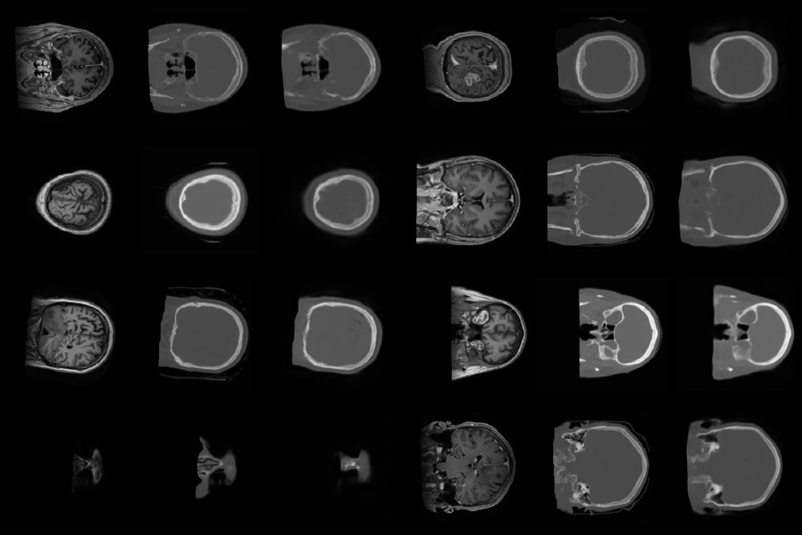

# RADGan
Simple conditional GAN for MRI to CT image synthesis.

## Dataset

You can get the dataset from the [Drive](https://drive.google.com/file/d/1puShvkkG9smK-azTdW22M61ncIemoziO/view?usp=sharing).

Just put it to project folder and it's done. It's the subset of the original dataset.

## Training

`python train.py`

## Results

The model evaluates the random samples from the validation set every n batch. Then it creates a grid image and saves it into "runs/[session]/".

